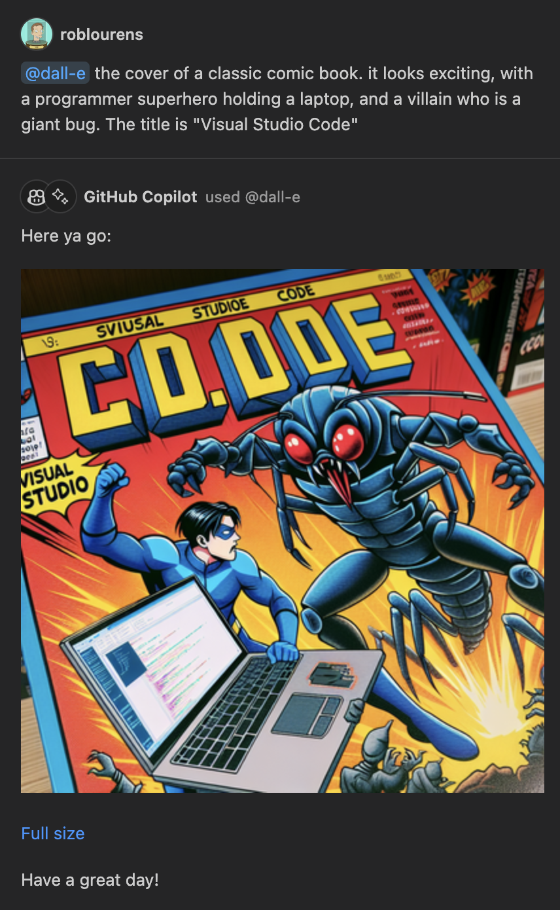
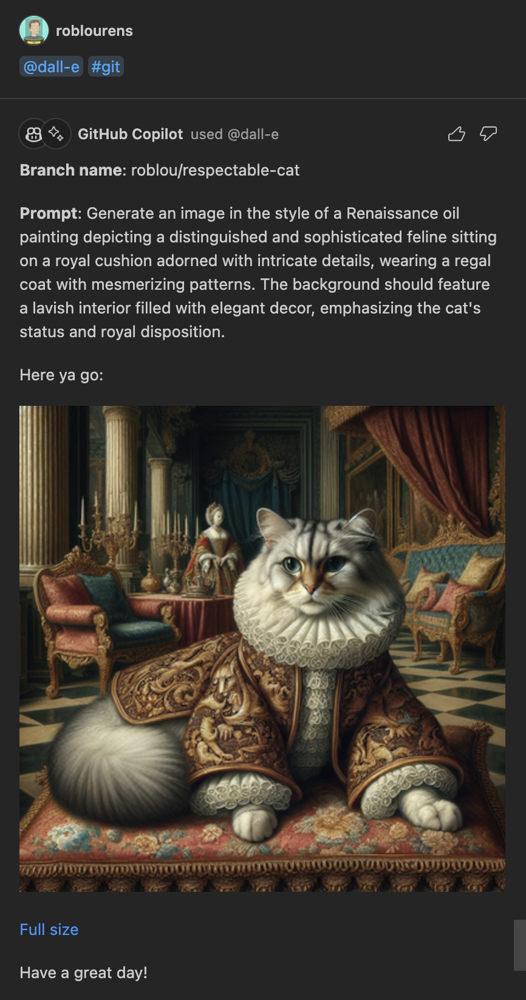
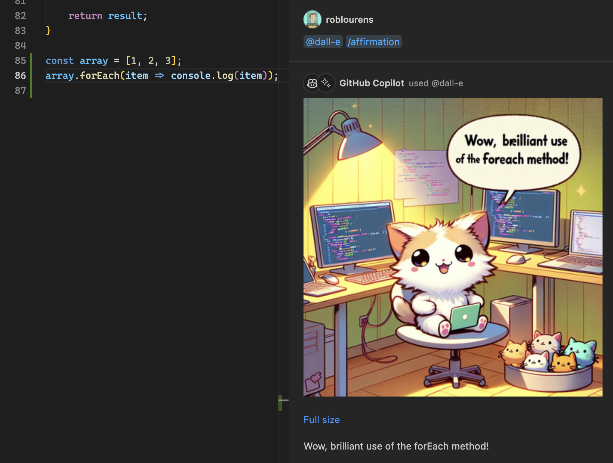

# chat-agent-dalle README

Use this agent to get images from DALL-E 3.

You can either write your prompt directly:

Or, you can use the `#git` variable to use a prompt generated from your git branch name, which is especially fun with VS Code's randomly-generated branch names:

Or, you can use the slash command `/affirmation` to see an image of a cute animal who has looked at the changes in your workspace, and will tell you something nice about them!

